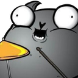
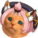
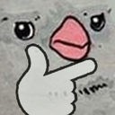
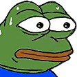
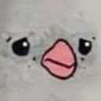
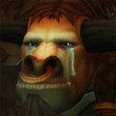
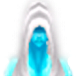

# TemniUgolokEmoji
Addon to replace in chat emoji like in Discord server

#### Shortcuts: 

 => `:ad:, :aga:, :aga_drochish:, agaDrochish`

 => `:ahri:, ahri`

 => `:bdum:, :bdum_tss:, bdumTss`

 => `:belok:, belok`

 => `:BURN:, burn`

 => `:damag_nahui_ne_nuzhen:, :dnnn:, damagNahuiNeNuzhen`

 => `:ooooo:, ooooooo`

 => `:opa:, opa`

 => `:raintru_ebalo:, :re:, raintruEbalo`

 => `:gc:, :gloom_chmok:, gloomChmok`

 => `:double_tilt:, :dt:, doubleTilt`

 => `:mirkusha:, mirkusha`

 => `:pch:, :PogChamp:, pogChamp`

 => `:jirok_uprls:, :ju:, jirokUprls`

 => `:fs:, :fufaika_stasa:, fufaikaStasa`

 => `:raintru_kaef:, :rk:, raintruKaef`

 => `:ne_shuti_tak:, :nst:, neShutiTak`

 => `:raintru:, raintru`

 => `:hmm:, hmm`

 => `:pc:, :pepeclown:, pepeclown`

 => `:notlike:, notLike`

 => `:Kappa:, kappa`

 => `:slowpoke:, slowPoke`

 => `:Kappapride:, :kp:, kappaPride`

 => `:known:, know`

 => `:fbm:, :FeelsBadMan:, feelsBadMan`

 => `:olegalul:, :olul:, olegalul`

 => `:monkas:, monkas`

 => `:kovanich:, kovanich`

 => `:dc:, :dc_priest:, dcPriest`

 => `:zachem_obidel:, :zo:, zachemObidel`

 => `:sps:, :sps_blizzard:, spsBlizzard`

 => `:raintru_nekaef:, :rnk:, raintruNeKaef`

 => `:SADBOY:, sadboy`

 => `:gloom:, gloom`

 => `:ohueli_sovsem:, :os:, ohueliSovsem`

 => `:shto:, shto`

 => `:wut:, wut`

 => `:derzhi_v_kurse:, :dvk:, derzhiVKurse`

 => `:lul:, :ol:, :omegalul:, omegalul`

 => `:PEPEGA:, pepega`

 => `:mldg:, :molodchaga:, molodchaga`

 => `:zemlya_puhom:, :zp:, zemlyaPuhom`
